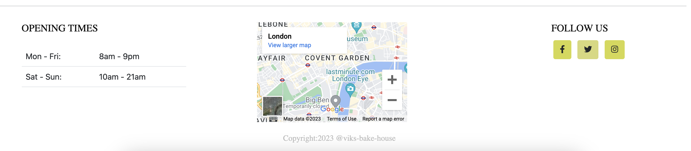

ADD RESPONSIVE IMAGE OF WEBSITE ON ALL DEVICES AND A LINK TO THE SITE BELOW THE IMAGE

# Viktoria's bake house 

For my fourth milestone project with Code Institute I have created a full-stack restaurant website called Viktoria's bake house, using the Agile plannnig approach and CRUD operations through a relational database.

The website idea is to give the user a look at the menu options and to sign up and leave a like or comment for the competiton page.

---

# List of contents

<li><a href="#target-audience">Target audience</a></li>
<li><a href="#user-stories">User stories</a></li>
<li><a href="#scope">Scope</a></li>
<li><a href="#structure">Structure</a></li>
<li><a href="#data-base">Data-base</a></li>
<li><a href="#wire-frames">wireframes</a></li>
<li><a href="#design">Design</a></li>
<li><a href="#base-page">Base page</a></li>
<li><a href="#home-page">Home page</a></li>
<li><a href="#blog-page">Blog page</a></li>
<li><a href="#menu-page">Menu page</a></li>
<li><a href="#contact-page">Contact page</a></li>
<li><a href="#authentication">Authentication</a></li>
<li><a href="#typography">Typography</a></li>
<li><a href="#colours">Colours</a></li>
<li><a href="#testing">Testing</a></li>
<li><a href="#technologys">Technology's</a></li>
<li><a href="#deployment">Deployment</a></li>

---

# Target Audience

When planning this project, one important part was to consider what type of user audience this would attract
and what key featuers could I use to benift that audience.

 - People of any ages
 - People that enjoy food
 - People that injoy creativity with food
 - People that enjoy dinning out and fine dinning

 I wanted to find people that would enjoy more than eating a nice cake. But to go out and enjoy some fine dinning with a variety of classic and modern cakes. To keep things more interesting, I added a cake competition tot he website. Users can register and leave comment or just like the best of three cakes displayed every month. 
 
---

# User stories

---

# Scope

 I tried to take in to account that all ages can use the site, so simplicity is the main goal here. 

 - The header and footer of each page is kept the same throughout all the pages, to keep symetry and repetitive UX experience. 

 - The nav bar consists if three links, a home page, menu drop down link and a contact form.

 - A registration form for users to make an account. Users information is then saved in the data base. Once registered, a user can see clearly that they are logged in. When a used chooses to log out, a second reminded message is asked before the user fully commits to being logged out.

 - Three menu pages which can be created, updated and deleted by a site administrator. 

 - A blog page where users can read and post from a cake competition. Users that are registered can create, read, update and delete a post they have made.

 - A contact form where users can send a message that is saved in the data base and for the site administrator to read. User post request has been tested with MailTrap https://mailtrap.io/ for contormation that the email has been sent and received to am email provider.

---
  
# Structure

This website is made for three apps
1. Cake menus app - display menus
2. Blog app - post images and comments
3. Contact app - customer support

The menu, blog and contact apps all use a data base to store the users information. For this I have built 5 models.

---

# Data base

### Menu models
I have created three serpate models for the cake menus. Each model is identical with displaying information on cake name, description, dietary and allergens.
Once a product has been added to the data base, the site administor can select when the product is added to the menu with an on_menu option.
A created_on date is also logged to the data base for when the product was added and a time feild. 

---

---

### Blog models

### Post model
This model consists of the follwing fields for a site administrator:
- A title and matching slug field

- Description field in which I installed Django summernotes libary for better text styling

- Status option for a darft post which is not posted or a pulished option to display the post

- An updated on field giving a date and time

- Feature image for an image to be uploaded with the post

- Approved field to give a final approval to diplay the post

- Likes function of the user to like a post

I wanted the administrator to control what was being posted and for future development, a user will get the option to post their own cakes.

---

### Comments model
This model is focused towards the user to display a comment. The model is controlled with the administors panel in the back end.
I wanted all post to be approved this way before being posted.
The data fields consist of the following:

- A CASCADE on delete function for when a comment is deleted by the user, is will be deleted from the data base also.
This is following django'sway of maintainind data integrity.

- Name field for a user to a their name, and a minimum of 80 characters

- an email feild for users email

- a body text field for the user to add a comemnt

- Created on to give a date and time of the post

- Approved option for the site administrator to approve to be posted

I have tried to follow some of the modern techniques within a comment being shown. By adding a time, date, like and to unlike a post. 

---

### Contact 
The contact form is more towards a general enquiry’s form. For this reason I wanted the enquiry to be sent to the database.

I have added the following fields:

- Name - Customers full name 

- Email - Customers email

- Messgae - input box text field for any enquiries 

- Not read - for administrative purposes to show now read

- read - for administrative purposes to select when the enquiry ahs been read

---

# Wire frames

### landing page

---

### Menus

---

### Post detail page

---

### Edit post page

--- 

### Contact

---

- Please be aware that the wireframes may be slightly different from the original site. 

# Design

---

# Base page

I wanted a symmetric feel throughout all pages with the website. To do this I created a base html page that extend its content of a header and footer on all pages. 

### Home page
 After getting good design ideas and information from https://elementor.com/blog/, who review website designs. I decided to keep a blank canvas in white for a background colour and then add colour with images.

I used a header image of a width of 100% to stretch across the whole screen on all devices. I want the image to give a good idea as to what the site is about, so choosing the correct imagine was inportant. I aslo added a fixed position to give a srolling effect for this image.

--- 

### Nav bar
The navigation bar for my site uses three links, home page, cake menus and a contact form. I have added a mouse over effect to change the colour of the text when the mouse cursor is on the link. This gives a user an indication that they about the use that link.

I have given a drop down menu for the all menu pages. This keepsthe nav bar small and with more functions.

For screen sizes of 900 piexls and smaller, the Navigation bar drops the collapseible button and  all three links can be accessed from there. This is keeping with modern UX design as most webpages are viewed on a mobile platform today.

---

### Footer
For a footer, I have given imformtaion on the opening hours, a google map of the location form which a user can view, an address and three common socail media links for the them to use and follow the webiste. I kept a white background using a line break effect to apply a speprate section of the page. 

For screen sizes of 900 pixels and smaller, the footer section will reduce it's size of content and be stacked on top of one another to keep a modern UX design. 

---

### Cake competition 
The competition section, I decied to keep it with the landing page. I wanted bring more colour to this part of the page, so by adding pictures with bright and vibrant colours it adds a good amount of colour. I added some text under the images to give a little more input of what to expecpt from the description above.

For screen sizes 900 and below, I have followed modern designs and stacked images on top of one another. I keep the images at a larger display to give a user a better feel to the image on a smaller screen. 

---

### Blog page
The blog page this is one of the main interests I believe that a user would like to visit on the website. I wanted to keep simplistically on this page as I have done throughout the website. Going by modern desgin ideas on a browser and table screen size and with the help from https://elementor.com/blog/, I have placed the image to the left and  the post detail section to the right. When reviewing sites such as FaceBook https://www.facebook.com/ and Instagram https://www.instagram.com/ I had noticed when adding a comment, it removes the user out of site from the image that they are commenting one. For better UX in my option, I would like the user to see the image when adding a comment. I my opinion tis gives a easy way to think about what to right not having to forget what the image looks like.

YOU NEED TO STYLE THE BLOG PAGE FOR MOBILE SCREEN SIZE!!!!!!!

### Edit blog page
When a user wants to edit a post, they are sent to a seperate page in which they can add or delete their psot in a simple form. This form layout stays the same when reducing to a smaller screen size.

---

### Menu page

With the menu pages I decied to postion the text in the center of the page for a better readable view on bigger screens. I use a couple of differnt font familys and font sizes to break up the layout as the menu only consists of text. 

I used three seperate pages for the menus as I wanted to keep the three cake type separate and to give an easier structure for reading each menu. I have added a product title, description, dietary and allergies information clearly within the menu on each product.

For screen sizes at 900 pixels and smaller, the menu uses a Bootstrap container to help keep text within a readable size and layout. For a mobile device, the text will be positioned to the left to give a better reader frendly experience.

---

### Contact Page
I wanted the contact for to be a simple and friendly form with not much input form the user. I would like the user to add a full name, email address the enquiry they wish to make. 

I have had a strong point to consider to not include a phone number field within the contact form. If the customer would like to contact the restaurant, there is a clear view of a phone number and address below the contact form.

---

# Authentication

Registration 

User registion follows the same design layout as all the other forms. I have added clear titles to all pages for user to not get confused. This registration form consists of a user adding a username, email address and a password which has a secondary input for the user to hopefully remember there password.

Sign in

The user sign in for is again a simple and quick form for the user to fill in. Once they have signed up, they can choose to use the full site and add a comment or like a post and jion the competion.

Once singed in, the user can see clearly that they are logged in as the sign and register buttons re removed from the nav bar and only the log out button is displayed. 

---

Sign out
For when the user wants to sign out, thwy will need to click on the sign out button in the nav bar. From there the site will ask them once more if they are 'sure to sign out'. Incase a user is to click sign out by mistake, this is a fail safe function.

---

# Typography

- All font family styling was used with an open source - Google Fonts https://fonts.google.com/

- Font family used for H1 - Montserrat "regular 400" https://fonts.google.com/specimen/Permanent+Marker?query=perm#standard-styles

- Default setting - "sans serif"

- Font family used for H3, H4 & P - ira Sans Condensed"light 300"

- Defaul setting - "sans serif"

- All icons are taken from an open source - fontawesome https://fontawesome.com/

---

# Colours

All colors where picked with desgin industry colours which are trusted within communitys of website design. I used a fastion colour plate in Adobe Color Wheel. the Shade of grey #BFBFBF is used to give a feeling of warmth with the text. I have used the a shade of yellow #D4D948 to gice a small pop of colour and detial with parts on the website. For when using the shade of black I used #0D0D0D. This shade gives a deeper colour and more detail to text. 

The reason I have not used many colours, is for the images to product the colour to the site. As the images are full of colour, I wanted them to stand out and make an impression to the user.

All colors are taken from an open source - Adobe Color Wheel https://color.adobe.com/create/color-wheel

- Background color for body - #00000 "white"

- Header title - #0D0D0D "Deep black"

- Nav bar text and h6 font size - #BFBFBF "medium / light grey"

- H1, H2,h3 H4 & H5 - #0D0D0D; "Deep black"

Icons  
- Heart Icon - ##e70c6b "pink"

- Edit post icon - #D3D925 "yellow"

- Delete post icon - #ef0707 "red"

- Links - #D3D925 "yellow"

- Buttons - bnt-success - "Bootstrap default button colour" "green"

---

# Testing

I have used  manual and automated testing to ensure the website's functionality meets the desired and developemnt standards throughou the website.

### Code Validation
All of my code has been validated using an online validator specific to the language, all code now passes with zero errors.

- CSS validation 
https://jigsaw.w3.org/css-validator/

### Automated Testing

I have used the Coverage library throughout testing to keep track of how much Python code was covered by the tests. From running the coverage report my website has of my code tested. The remaining code is covered by manual testing.

### Automated tests

I have tested all three of the projects apps and have covered a total of 83%. For the rest of my tesing I will manually test all functions.

### Menus app test

### Blog app test

### Contact app test

Installing Coverage and report commands

- Install the package using pip3 install coverage

- Run coverage run manage.py test

- Then coverage html to generate the report

- You can view the report in a browser by using the command python3 -m http.server and opening the index.html file from inside the htmlcov folder.

### Manual tests

### Landing page
- How design looks and feels with contrasting colors and text 
- How all images and text look on screen sizes for brower, tablet and mobile
- Nav bar links function to correct urls and hoover effect works with mouse courser
- Post section shows clear images and cards reacts when user selects to view card as a post in post detial page
- Footer section shows clear information and google maps open on a separate page for user to view.
- Registration and sign in buttons are easy to view and react to a mouse curser.
- Social media links are displayed and send user to correct url as intended

### Authentication form
- Registration button takes user to new page and a clear form to add details
- Required input field works to indicate to the user that all form fields need information before submitting 
- Submit button is well presented and the url is given 
- Message handler gives well presented message to user after submittion
- Returns user to index url as excepted 

### Sign in / out form
- Registration button takes user to new page and a clear form to add details
- Required input field works to indicate to the user that all form fields need 
- Message handler gives weel resented message to user after submittion
- Logout asks user for second conformation of sign out
- Returns user to index url as excepted 

### Post detail page
- Gives user nice visual layout of images and post a comment areaa
- User is given good imformtion on the product 
- A clear indication of how to delete and update a comment
- Post detail displays well in browser, tablet and mobile screen sizes
- Message handler gives well presented message to user after editing post or deleting a post

### Cake menus
- All three menu links send user to correct url for the menu they choose
- Menus a well designed and easy to read and understand 
- Menu fonts and text are desplay well for all screeen sizes
---

### Bugs and testing

--- 

# Technology's

---

# Deployment

### Deplyment Django application follow link instructions 

- https://github.com/Code-Institute-Org/python-essentials-template

### Repository using GitPod

- Navigate to the repository page on GitHub
- Click the "GitPod" button in the top right of the repository.
- Once the project is open you can follow this link.
- To create a Gitpod workspace you then need to click Gitpod.
- Now you can create your files within your work space. Remeber to add .html for example when creating a html file, as this lets Gitpod know what script and code you will be creating. 
- For documentation and saving your work, which should be done on a regular basis. use the command: 
- git add .
- git commit -m"YOUR MESSAGE HERE! PLEASE KEEP IT SHORT BUT BRIEF!"
- git push ( saves your work with the commit message. Your work will now be pushed to your GitHub repository )

# Setting up Django Project and Deploying to Heroku

### Please follow the cheat sheet links below and in the order provided.

1. https://docs.google.com/document/d/1P5CWvS5cYalkQOLeQiijpSViDPogtKM7ZGyqK-yehhQ/edit#

2. Deployment: Heroku app
- Click "create a new app" in top right corner 
- Give your app a name and select the region closest to you. When you’re done, click “Create app” to confirm.

3. Create a database
- Log in to ElephantSQL.com to access your dashboard
- Click “Create New Instance”

Set up your plan
- Give your plan a Name (this is commonly the name of the project)
- Select the Tiny Turtle (Free) plan
- You can leave the Tags field blank
- Select “Select Region”
- Then click “Review”
- Return to the ElephantSQL dashboard and click on the database instance name for this project
- In the URL section, click the copy icon to copy the database URL

### That’s the database created

### Process 
- In your project workspace, create a file called env.py. It’s a good idea to check that this file is included in the .gitignore file too. If you are using the Code Institute provided GitHub template, then the env.py file is already in the .gitignore file.
- In your env.py file add the following line of code.
 import os

 - Next we need to set some environment variables.
 os.environ["DATABASE_URL"]="<copiedURL>"

 - As this is a Django application it has a SECRET_KEY
  os.environ["SECRET_KEY"]="my_super^secret@key"

### We don't want to share our secrets either, so this documentation shows you a made up key. Just replace my_super^secret@key with your key

### Make sure you save the file.

### Modifying settings.py
- Now you have created an env.py file in your file paths
add the follow:
 import os
 import dj_database_url
 if os.path.isfile('env.py'):
     import env

- A little further down, remove the insecure secret key provided by Django and replace with:
 SECRET_KEY = os.environ.get('SECRET_KEY')

 - Now that is taken care of, we need to hook up your database. We are going to use the dj_database_url import
 Comment out the original DATABASES variable and add the code below, as shown. 
 The please add:
  - DATABASES = {
     'default': dj_database_url.parse(os.environ.get("DATABASE_URL"))
 }

 ### The code that has been commented out connects your Django application to the created db.sqlite3 database within your repo. 

 - With those changes in place, make sure to save your file. Your application will now connect to your remote database hosted on ElephantSQL

 -  Run the coomand - python manage.py migrate

---
# Creating an app in Django
please follow the link the instructions to create an app 

- https://codeinstitute.s3.amazonaws.com/fst/Django%20Blog%20Cheat%20Sheet%20v1.pdf